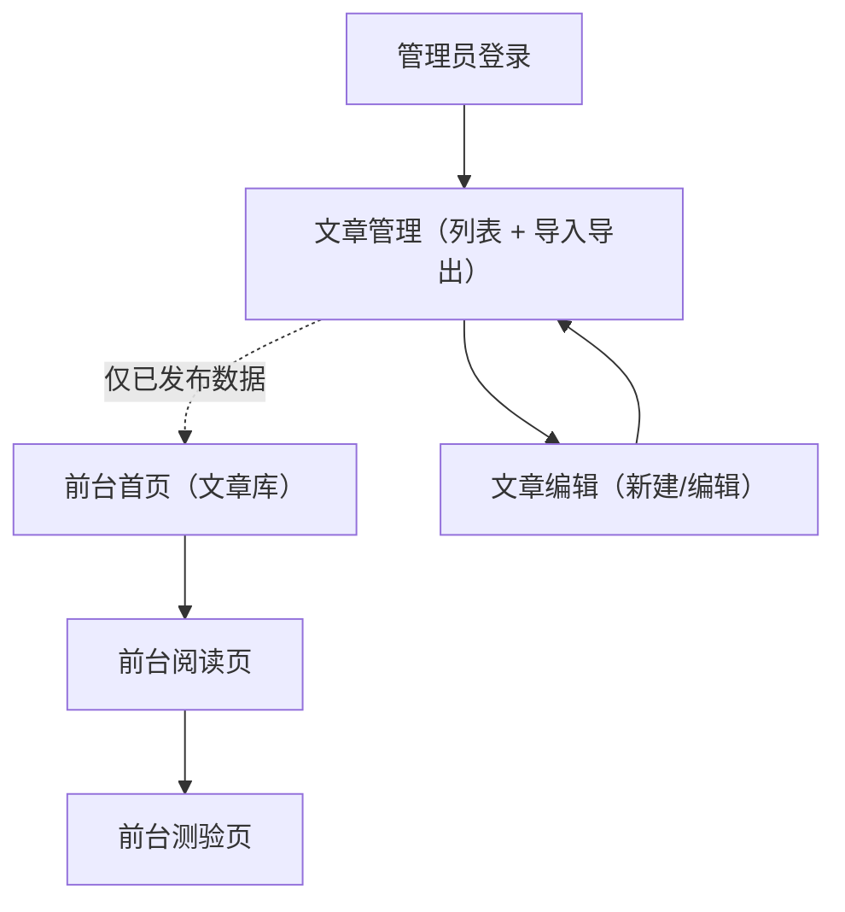

## 1. Product Overview
一个桌面优先的文章管理后台，用于对英语精读文章进行增删改查，并支持按既有数据结构进行 JSON 导入/导出。
管理员通过基础鉴权进入后台，维护的数据可被前台阅读/测验模块直接消费。

## 2. Core Features

### 2.1 User Roles
| 角色 | 注册/登录方式 | 核心权限 |
|------|----------------|----------|
| 访客/普通读者 | 无需登录 | 仅可读取“已发布”的文章与测验数据（前台使用） |
| 管理员 | 管理员账号密码（或等价的令牌登录） | 文章增删改查、发布/撤回、JSON 导入/导出 |

### 2.2 Feature Module
文章管理后台的最小可用版本包含以下页面：
1. **管理员登录**：管理员身份验证、登录态保持/退出。
2. **文章管理（列表 + 导入导出）**：文章列表检索筛选、创建/编辑入口、删除、发布状态管理、JSON 导入/导出。
3. **文章编辑（新建/编辑）**：编辑文章元信息与内容结构（段落/词汇/测验）、校验与保存、预览。

### 2.3 Page Details
| Page Name | Module Name | Feature description |
|-----------|-------------|---------------------|
| 管理员登录 | 管理员鉴权 | 输入管理员凭证完成登录；登录成功后写入会话；支持退出并清理会话。 |
| 文章管理（列表 + 导入导出） | 文章列表 | 展示文章（id、标题、级别、主题、状态、更新时间）；支持按关键字/级别/主题/状态筛选与排序；进入编辑页。 |
| 文章管理（列表 + 导入导出） | 新建/复制/删除 | 新建文章（生成新 id 或手填）；可从现有文章复制生成草稿；删除需二次确认。 |
| 文章管理（列表 + 导入导出） | 发布状态 | 将草稿设为“已发布”或“草稿/撤回”；前台仅消费已发布文章。 |
| 文章管理（列表 + 导入导出） | JSON 导入 | 上传符合既有 `ArticleDataset` 结构的 JSON；导入前进行结构校验与冲突提示；支持按 `id` upsert（新增/覆盖）。 |
| 文章管理（列表 + 导入导出） | JSON 导出 | 一键导出当前全量数据为 `ArticleDataset` JSON（含 version、updatedAtISO、articles）。 |
| 文章编辑（新建/编辑） | 元信息编辑 | 编辑 `id/title/level/topic/summary/estimatedMinutes/status`；对必填字段与枚举值做校验。 |
| 文章编辑（新建/编辑） | 内容结构编辑 | 以结构化表单维护 `paragraphs/vocab/quiz`；支持增删改排序；保证与前台类型兼容（字段命名与含义一致）。 |
| 文章编辑（新建/编辑） | JSON 模式与校验 | 提供“JSON 源码”模式（粘贴/编辑）与即时校验错误提示；保存前阻断不合法数据。 |
| 文章编辑（新建/编辑） | 预览与保存 | 预览阅读端渲染效果（段落/翻译/题目）；保存为草稿或直接发布；保存后返回列表。 |

## 3. Core Process
**管理员内容维护流程**：你打开后台 → 登录 → 在文章列表中检索/筛选 → 新建或进入某篇文章编辑 → 填写元信息与段落/词汇/测验 → 校验通过后保存为草稿或发布 → 前台读取已发布数据。

**JSON 导入流程**：你在列表页选择导入 → 上传 JSON → 系统校验结构与 `id` 冲突 → 你确认覆盖/新增策略 → 写入并提示导入结果（成功/失败条目）。

**JSON 导出流程**：你在列表页点击导出 → 系统聚合为 `ArticleDataset` → 下载 JSON 文件。

