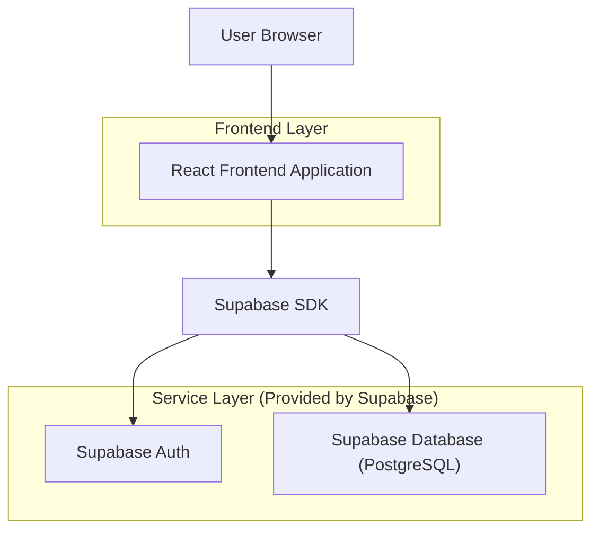
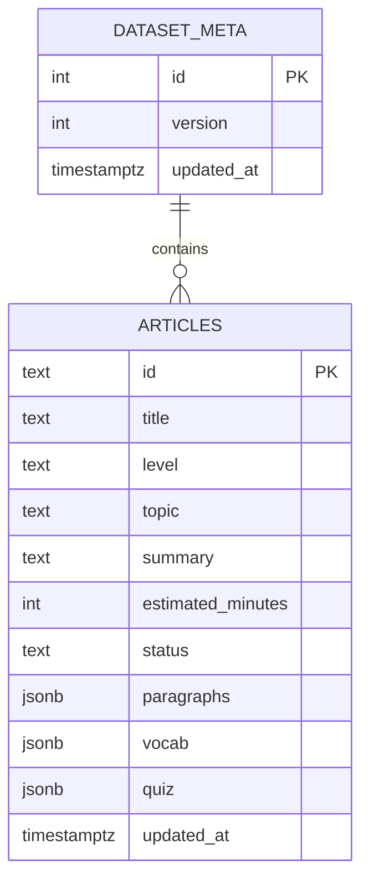

## 1.Architecture design


## 2.Technology Description
- Frontend: React@18 + TypeScript + vite
- Styling: tailwindcss@3
- Backend: Supabase（Auth + PostgreSQL）

## 3.Route definitions
| Route | Purpose |
|-------|---------|
| / | 前台文章库（仅消费已发布文章） |
| /read/:articleId | 前台阅读页（兼容既有 paragraphs/vocab） |
| /quiz/:articleId | 前台测验页（兼容既有 quiz 结构） |
| /admin/login | 管理员登录 |
| /admin/articles | 文章管理（列表 + 导入/导出） |
| /admin/articles/new | 新建文章 |
| /admin/articles/:articleId | 编辑文章 |

## 6.Data model(if applicable)

### 6.1 Data model definition
说明：为确保与现有前台类型兼容，核心结构（paragraphs/vocab/quiz）以 JSONB 存储，字段与 `ArticleDataset` 保持一致。



### 6.2 Data Definition Language
Dataset 元信息表（dataset_meta）与文章表（articles）：

```sql
-- 1) dataset_meta: 单行保存导出所需的 version/updatedAt
CREATE TABLE dataset_meta (
  id INTEGER PRIMARY KEY,
  version INTEGER NOT NULL DEFAULT 1,
  updated_at TIMESTAMPTZ NOT NULL DEFAULT NOW()
);

INSERT INTO dataset_meta (id, version) VALUES (1, 1)
ON CONFLICT (id) DO NOTHING;

-- 2) articles: 与现有 Article 结构兼容（paragraphs/vocab/quiz 直接存 JSONB）
CREATE TABLE articles (
  id TEXT PRIMARY KEY,
  title TEXT NOT NULL,
  level TEXT NOT NULL,
  topic TEXT NOT NULL,
  summary TEXT NOT NULL,
  estimated_minutes INTEGER,
  status TEXT NOT NULL DEFAULT 'draft', -- 'draft' | 'published'
  paragraphs JSONB NOT NULL,
  vocab JSONB NOT NULL,
  quiz JSONB NOT NULL,
  updated_at TIMESTAMPTZ NOT NULL DEFAULT NOW()
);

CREATE INDEX idx_articles_status ON articles(status);
CREATE INDEX idx_articles_level ON articles(level);
CREATE INDEX idx_articles_topic ON articles(topic);

-- 3) Row Level Security
ALTER TABLE dataset_meta ENABLE ROW LEVEL SECURITY;
ALTER TABLE articles ENABLE ROW LEVEL SECURITY;

-- anon：允许读取元信息 + 已发布文章（用于前台）
CREATE POLICY anon_read_dataset_meta
  ON dataset_meta FOR SELECT
  TO anon
  USING (true);

CREATE POLICY anon_read_published_articles
  ON articles FOR SELECT
  TO anon
  USING (status = 'published');

-- authenticated（管理员登录后）：允许全量读写
CREATE POLICY authed_all_dataset_meta
  ON dataset_meta FOR ALL
  TO authenticated
  USING (true)
  WITH CHECK (true);

CREATE POLICY authed_all_articles
  ON articles FOR ALL
  TO authenticated
  USING (true)
  WITH CHECK (true);

-- 4) Grants（与 Supabase 角色约定一致）
GRANT SELECT ON dataset_meta TO anon;
GRANT SELECT ON articles TO anon;

GRANT ALL PRIVILEGES ON dataset_meta TO authenticated;
GRANT ALL PRIVILEGES ON articles TO authenticated;
```

共享 TypeScript 类型（与既有文档一致，作为前后台/导入导出契约）：
```ts
export type ArticleLevel = "A2" | "B1" | "B2" | "C1";

export type ArticleParagraph = {
  index: number;
  text: string;
  translation: string;
};

export type VocabItem = {
  term: string;
  ipa?: string;
  meaning: string;
  example?: string;
  sourceParagraphIndex?: number;
};

type QuizQuestionBase = {
  id: string;
  prompt: string;
  sourceParagraphIndex?: number;
  explanation: string;
  analysis: string;
};

export type MCQQuestion = QuizQuestionBase & {
  type: "mcq";
  options: string[];
  correctOptionIndex: number;
};

export type ShortAnswerQuestion = QuizQuestionBase & {
  type: "short";
  correctAnswers: string[];
};

export type QuizQuestion = MCQQuestion | ShortAnswerQuestion;

export type Article = {
  id: string;
  title: string;
  level: ArticleLevel;
  topic: string;
  summary: string;
  estimatedMinutes?: number;
  paragraphs: ArticleParagraph[];
  vocab: VocabItem[];
  quiz: QuizQuestion[];
};

export type ArticleDataset = {
  version: number;
  updatedAtISO: string;
  articles: Article[];
};
```
