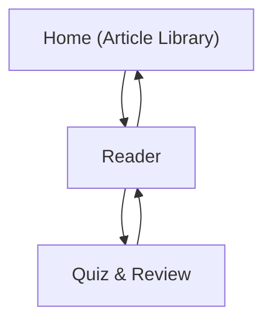

## 1. Product Overview
A desktop-first web app for English intensive reading practice.
You read curated articles, reveal translations per paragraph, study vocab cards, and take instant-feedback quizzes.

## 2. Core Features

### 2.1 User Roles
| Role | Registration Method | Core Permissions |
|------|---------------------|------------------|
| Visitor | None | Browse article list, read articles, use vocab cards, take quizzes, save progress locally in the browser |

### 2.2 Feature Module
Our intensive reading requirements consist of the following main pages:
1. **Home (Article Library)**: article list, quick filters, continue reading.
2. **Reader**: paragraph-by-paragraph reading, translation expand/collapse, vocab cards, progress tracking.
3. **Quiz & Review**: question flow, immediate feedback, optional analysis reveal, score summary.
4. **Inline Translate (Reader enhancement)**: long-press a word or select a phrase to translate.

### 2.3 Page Details
| Page Name | Module Name | Feature description |
|-----------|-------------|---------------------|
| Home (Article Library) | Article list | Display hardcoded articles with title, level, word count/estimated time, short summary. |
| Home (Article Library) | Filters & resume | Filter by level/topic; continue last opened article from local progress. |
| Reader | Article loader | Load article content from a hardcoded data file by `articleId`; show “not found” state. |
| Reader | Paragraph reading | Render paragraphs in order with numbering; highlight current paragraph. |
| Reader | Translation expand/collapse | Toggle translation per paragraph (collapsed by default); allow expand all/collapse all. |
| Reader | Vocab cards | Show vocab list for the article (or per paragraph); flip card to reveal meaning/example; mark “known”. |
| Reader | Progress | Persist last paragraph position, translation toggles, and known vocab in local storage. |
| Reader | Start quiz | Start quiz for the current article; pass `articleId` to quiz page. |
| Reader | Inline translate: long-press | Long-press any English word (≥800ms) to show a floating translate popover. Prioritize curated vocab mapping. |
| Reader | Inline translate: selection | Select a phrase (≥4 words) to translate; trigger after selection end with debounce; show result in the same popover. |
| Reader | Inline translate: settings | Toggle enable/disable; choose translate provider; show loading + error states; cache repeated requests. |
| Quiz & Review | Question runner | Present questions (MCQ + short answer as defined in data); accept answer; lock question after submit. |
| Quiz & Review | Immediate feedback | Show correct/incorrect instantly with brief explanation; enable “Next”. |
| Quiz & Review | Analysis reveal | Keep deeper analysis hidden until user clicks “Show analysis”; then display rationale and references (e.g., paragraph index). |
| Quiz & Review | Results summary | Show score, missed questions list, and “Review in Reader” deep-link to related paragraph. |

## 3. Core Process
**Reading Flow**: You pick an article → read paragraph-by-paragraph → expand translations only when needed → review vocab cards and mark known → your position and known vocab save automatically → you start a quiz when ready.

**Quiz Flow**: You answer each question → you immediately see correct/incorrect feedback → you optionally reveal deeper analysis → you finish and see a summary → you jump back to the related paragraph to review.

**Inline Translate Flow**: You long-press a word or select a phrase → UI tries vocab-first match (word-only) → if not found, request backend translate API → show loading and result in a floating popover → cached results return instantly on repeats.

### Hardcoded article data file requirements
- The app must ship with at least one local data file containing all article + quiz + vocab content.
- Recommended location: `src/data/articles.ts` (or `src/data/articles.json`).
- Each article must include, at minimum:
  - `id` (string, URL-safe), `title`, `level` (e.g., A2/B1/B2), `topic` (string)
  - `paragraphs`: ordered array of `{ index: number, text: string, translation: string }`
  - `vocab`: array of `{ term: string, ipa?: string, meaning: string, example?: string, sourceParagraphIndex?: number }`
  - `quiz`: array of questions with stable ids, correct answers, and analysis text (used by “analysis reveal”).
- All app features must work offline against this hardcoded dataset (no backend required).
