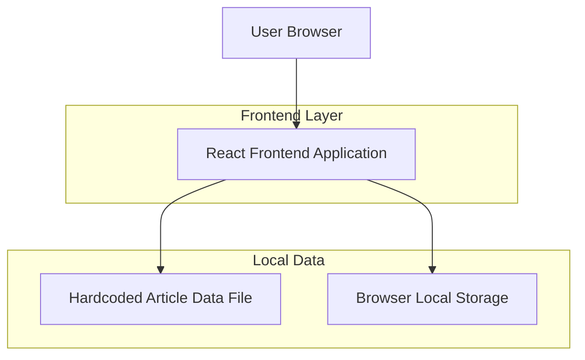

## 1.Architecture design


## 2.Technology Description
- Frontend: React@18 + TypeScript + vite
- Styling: tailwindcss@3
- Backend: None
- Data: Hardcoded dataset file (`src/data/articles.ts` or `src/data/articles.json`)
- Persistence: Browser Local Storage (progress + known vocab)

## 3.Route definitions
| Route | Purpose |
|-------|---------|
| / | Home library page to browse and resume articles |
| /read/:articleId | Reader page with translation toggles, vocab cards, and start-quiz entry |
| /quiz/:articleId | Quiz flow with immediate feedback, analysis reveal, and results |

## 4.API definitions (If it includes backend services)
Translate API (Reader enhancement):
| Method | Route | Purpose |
|--------|-------|---------|
| POST | /api/translate | Translate word/phrase; supports provider selection; server-side cache; vocab-first should be done client-side for best latency |

## 4.API definitions (If it includes backend services)
Not applicable (no backend).

## 6.Data model(if applicable)

### 6.1 Data model definition
Hardcoded dataset types (shared across UI modules):
```ts
export type ArticleLevel = "A2" | "B1" | "B2" | "C1";

export type ArticleParagraph = {
  index: number; // 0-based or 1-based, but must be consistent
  text: string;
  translation: string;
};

export type VocabItem = {
  term: string;
  ipa?: string;
  meaning: string;
  example?: string;
  sourceParagraphIndex?: number;
};

type QuizQuestionBase = {
  id: string;
  prompt: string;
  sourceParagraphIndex?: number;
  explanation: string; // shown in immediate feedback
  analysis: string; // only shown after “Show analysis”
};

export type MCQQuestion = QuizQuestionBase & {
  type: "mcq";
  options: string[];
  correctOptionIndex: number;
};

export type ShortAnswerQuestion = QuizQuestionBase & {
  type: "short";
  correctAnswers: string[]; // normalized matching
};

export type QuizQuestion = MCQQuestion | ShortAnswerQuestion;

export type Article = {
  id: string;
  title: string;
  level: ArticleLevel;
  topic: string;
  summary: string;
  estimatedMinutes?: number;
  paragraphs: ArticleParagraph[];
  vocab: VocabItem[];
  quiz: QuizQuestion[];
};

export type ArticleDataset = {
  version: number;
  updatedAtISO: string;
  articles: Article[];
};
```

Local persistence (Local Storage) recommended keys:
- `eir.lastArticleId: string`
- `eir.progress.{articleId}: { lastParagraphIndex: number }`
- `eir.knownVocab: Record<string, true>` (keyed by normalized term)

Inline translate (Local Storage) recommended keys:
- `eir.translate.enabled: boolean`
- `eir.translate.provider: string`

### 6.2 Data Definition Language
Not applicable (no database).
